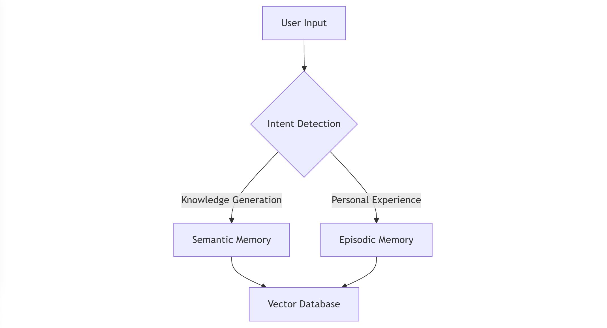

# Casey's Memory Systems Documentation

Casey implements a sophisticated dual-memory architecture inspired by human cognition: Semantic Memory for knowledge and facts, and Episodic Memory for experiences and personal interactions. This documentation details both systems' technical implementations and workflows.

## Integration and Interaction

### Memory Interaction Flow

When a user interacts with Casey, both memory systems work in tandem. For example, when discussing anxiety:

1. Episodic memory provides:
   - Personal context from past conversations
   - User's specific experiences and challenges
   - Individual history and preferences

2. Semantic memory contributes:
   - Professional mental health knowledge
   - Evidence-based strategies and information
   - Understanding of psychological concepts

3. The combination enables:
   - Personalized support grounded in professional knowledge
   - Context-aware responses that consider both personal history and clinical - understanding
   - Consistent, informed assistance over time

This dual memory architecture makes Casey highly adaptable - while we're currently focusing on mental wellbeing support, the same technology could be applied to create specialized companions for education, professional development, or any other knowledge-intensive field. The focus on mental wellbeing is a choice based on current social needs, not a technical limitation.

### Cross-Memory Features

1. **Context Sharing**
   - Semantic knowledge enhances personal context
   - Episodic memories inform knowledge application

2. **Combined Retrieval**
   - Relevant facts with personal context
   - Experience-enhanced knowledge

3. **Temporal Alignment**
   - Knowledge evolution tracking
   - Experience timeline maintenance

## Performance Considerations

### Semantic Memory
- Fact independence validation
- Relationship maintenance
- Knowledge deduplication
- Update mechanisms

### Episodic Memory
- Significance thresholds
- Context preservation
- Temporal ordering
- Privacy considerations

## Future Enhancements

1. **Memory Consolidation**
   - Cross-memory synthesis
   - Knowledge evolution tracking
   - Experience pattern recognition

2. **Integration Expansion**
   - Additional knowledge sources
   - Enhanced personal context
   - Improved significance detection