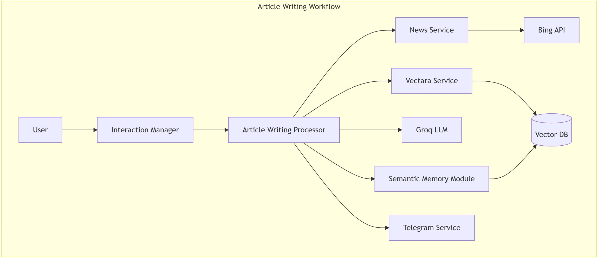

## Article Writing Workflow



### Trigger
- User requests article generation
- `InteractionManager` detects "article_writing" intent

### Process Flow
1. **Intent Detection & Parameter Extraction**
   - LLM analyzes user request for:
     - Main topic
     - Subtopics
     - Target audience
     - Tone
     - Complexity level

2. **News Collection**
   ```
   InteractionManager -> ArticleWritingProcessor -> NewsService -> Bing News API
   ```
   - Fetches relevant articles using Bing News API
   - Articles are filtered and chunked using `RecursiveCharacterTextSplitter`

3. **Context Building**
   ```
   ArticleWritingProcessor -> VectaraService
   ```
   - Article chunks are stored in Vectara vector database
   - Advanced semantic search with reranking retrieves most relevant pieces
   - Sources are transformed into structured XML context

4. **Content Generation**
   ```
   ArticleWritingProcessor -> Groq LLM
   ```
   - Combines source material with writing instructions
   - Generates article with specified structure
   - Includes title, sections, and source citations

5. **Knowledge Preservation**
   ```
   ArticleWritingProcessor -> SemanticMemoryModule
   ```
   - Generated article is stored in semantic memory
   - Enables future reference and context building

### Unique Features
- Source material integration
- Semantic search for relevant context
- Structured article format
- Knowledge preservation