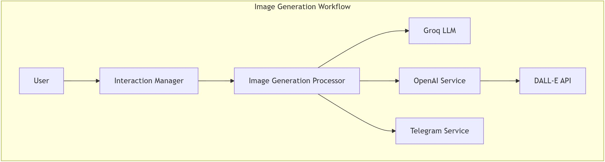

## Image Generation Workflow



### Trigger
- User requests image creation
- `InteractionManager` detects "generate_image" intent

### Process Flow
1. **Prompt Engineering**
   ```
   InteractionManager -> ImageGenerationProcessor
   ```
   - LLM converts user request into optimized DALL-E prompt
   - Extracts style, composition, and detail parameters

2. **Image Generation**
   ```
   ImageGenerationProcessor -> OpenAIService -> DALL-E
   ```
   - Sends structured prompt to DALL-E
   - Receives generated image URL

### Unique Features
- Advanced prompt engineering
- High-quality image generation
- Style and composition control