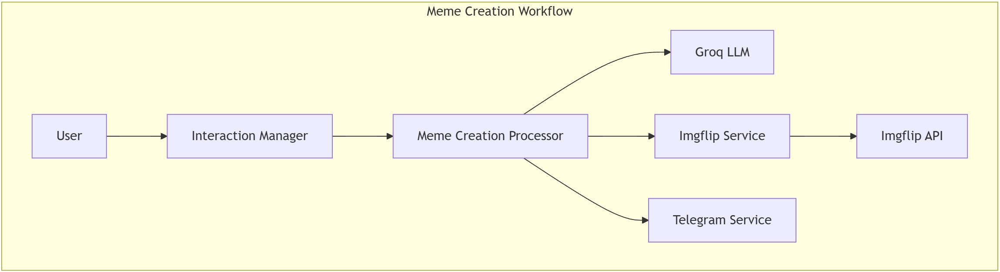

## Meme Creation Workflow



### Trigger
- User requests meme creation
- `InteractionManager` detects "create_meme" intent

### Process Flow
1. **Template Selection**
   ```
   InteractionManager -> MemeCreationProcessor -> ImgflipService
   ```
   - Retrieves available meme templates
   - LLM selects appropriate template

2. **Text Generation**
   ```
   MemeCreationProcessor -> Groq LLM
   ```
   - Generates top and bottom text
   - Optimizes for humor and context

3. **Meme Creation**
   ```
   MemeCreationProcessor -> ImgflipService
   ```
   - Combines template with generated text
   - Creates final meme image

### Unique Features
- Template matching
- Humor optimization
- Text positioning
- Format preservation