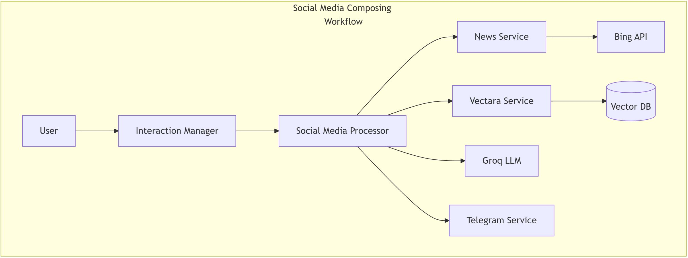

## Social Media Composing Workflow



### Trigger
- User requests social media content
- `InteractionManager` detects "compose_social_media" intent

### Process Flow
1. **Platform Analysis**
   ```
   InteractionManager -> SocialMediaComposingProcessor
   ```
   - LLM determines target platform
   - Extracts post requirements

2. **Context Building**
   ```
   SocialMediaComposingProcessor -> NewsService -> VectaraService
   ```
   - Gathers relevant news for context
   - Performs advanced semantic search with reranking for related content

3. **Content Generation**
   ```
   SocialMediaComposingProcessor -> Groq LLM
   ```
   - Generates platform-specific content
   - Adheres to platform constraints:
     - Twitter: 280 characters
     - LinkedIn: 1200-1500 characters
     - Facebook: 500-1000 characters
     - Instagram: 2200 characters

### Unique Features
- Platform-specific formatting
- Character limit compliance
- Hashtag optimization
- Context-aware tone adaptation