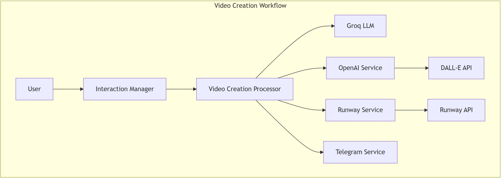

## Video Creation Workflow



### Trigger
- User requests video creation
- `InteractionManager` detects "create_video" intent

### Process Flow
1. **Image Generation**
   ```
   InteractionManager -> VideoCreationProcessor -> OpenAIService
   ```
   - Creates base image using DALL-E
   - Optimizes for video conversion

2. **Video Animation**
   ```
   VideoCreationProcessor -> RunwayService
   ```
   - Converts static image to video
   - Applies motion and effects

### Unique Features
- Image-to-video conversion
- Motion generation
- Visual continuity
- Multi-stage processing